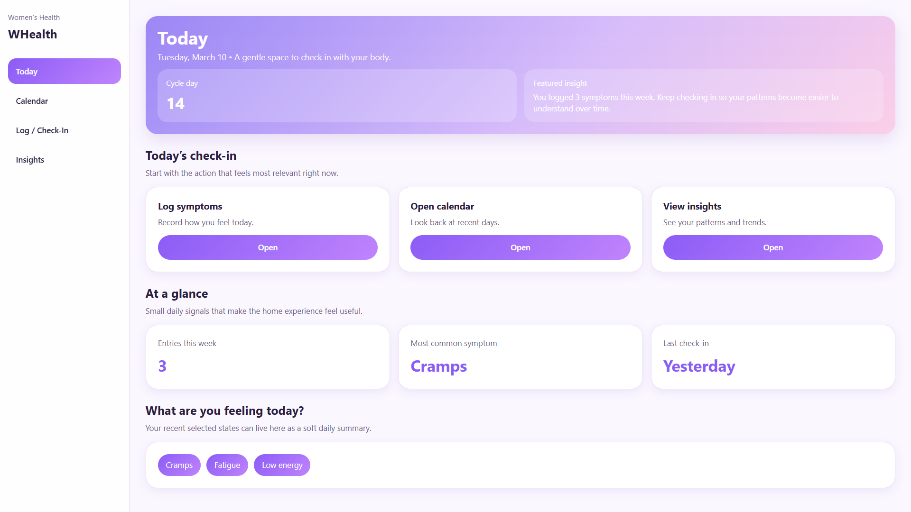
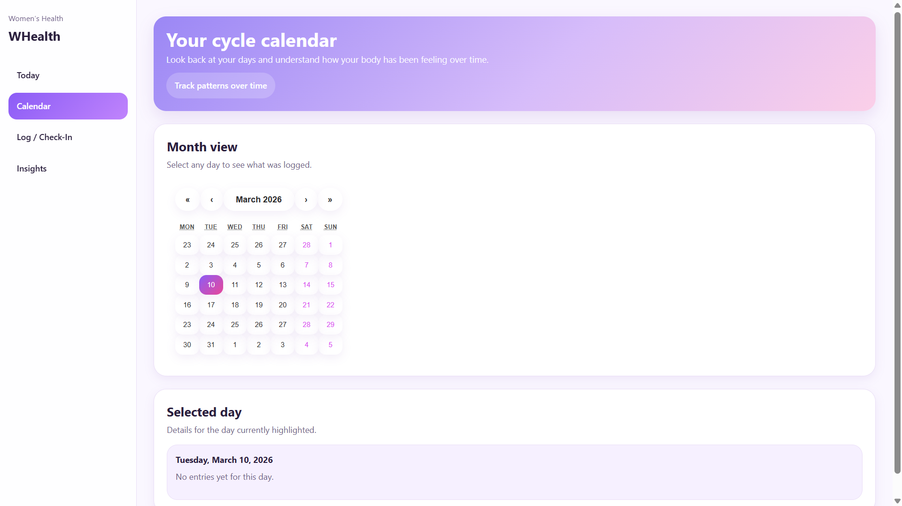
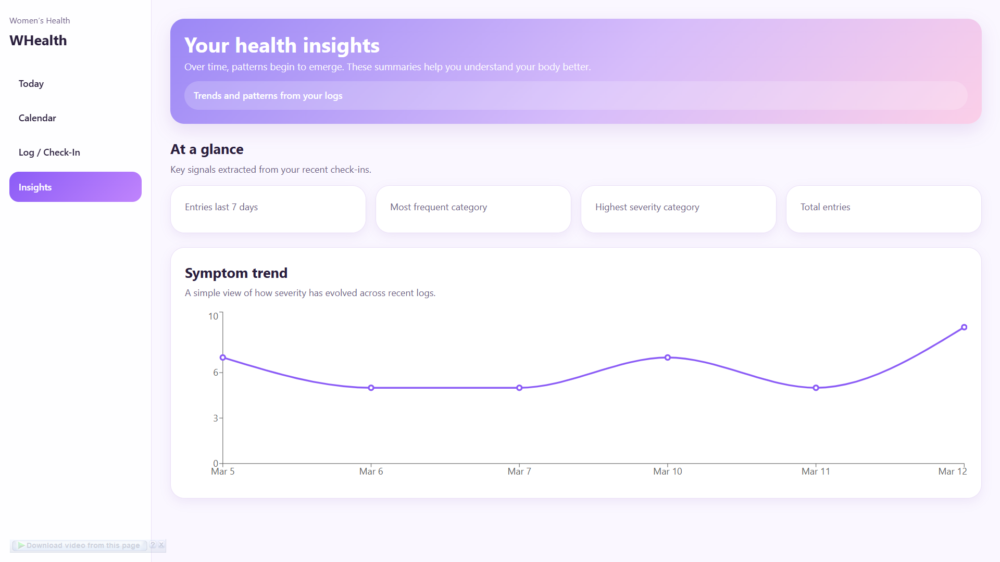
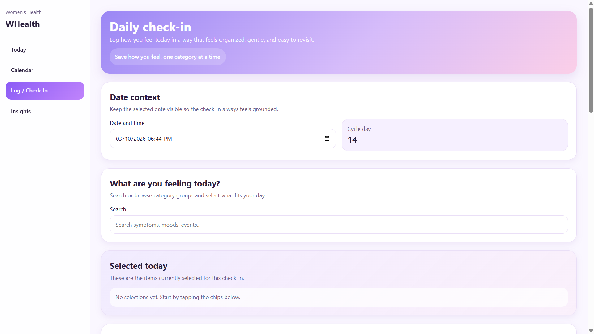
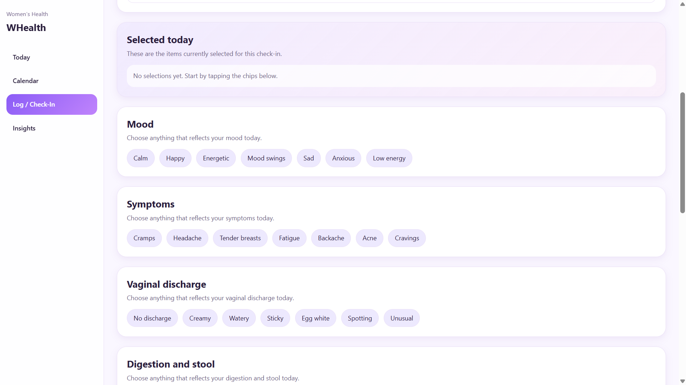
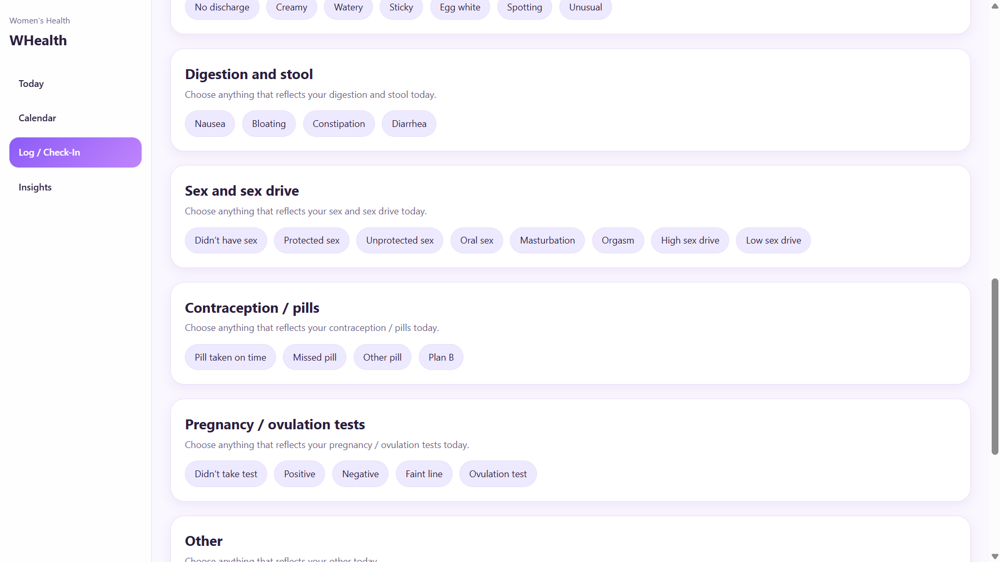
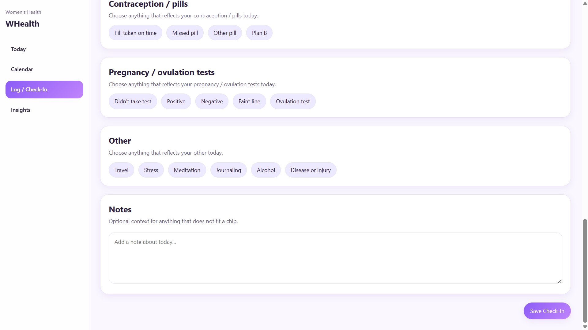

# Women’s Health Symptom Tracker

A modern women’s health tracking web application designed to help users log symptoms, understand patterns in their health data, and visualize trends over time.

The project evolved from a backend prototype into a product-oriented MVP with a redesigned frontend inspired by consumer health applications such as Flo.

This repository demonstrates full-stack engineering, including:

* API design
* database modeling
* frontend product UX
* data visualization
* containerized infrastructure

## Features

### Today Page


The Today page serves as the main daily home screen and includes:

* cycle context placeholder
* quick actions
* weekly activity summary
* selected symptom overview

This page was designed to feel personal, calm, and product-oriented, rather than like a traditional admin dashboard.

### Calendar / Cycle View



The Calendar page provides a month-based history view of logged health events.

Users can:

* navigate months
* select specific days
* view entries for the selected date

The goal is to give users a cycle-centered view of their health history.

### Health Insights


The Insights page visualizes patterns extracted from logged health data.

It currently includes:

* entries in the last 7 days
* most frequent category
* highest severity category
* total entries tracked
* severity trend chart

The visualization layer uses Recharts to display time-based trends.

### Daily Health Logging






Users can log how they feel using a structured daily check-in experience.
The logging interface organizes health events into categories such as:

* Mood
* Symptoms
* Digestion
* Vaginal discharge
* Sex and sex drive
* Contraception and pills
* Pregnancy / ovulation tests
* Lifestyle factors

Users select items using interactive chips that create structured symptom entries.


## Architecture

The application follows a full-stack web architecture.

```
React (Frontend)
       │
       │ REST API
       ▼
FastAPI (Backend)
       │
       │ ORM
       ▼
PostgreSQL Database
```
The project is fully containerized using Docker.

## Tech Stack
### Frontend

* React
* TypeScript
* Vite
* Recharts
* React Calendar

### Backend

* FastAPI
* SQLAlchemy
* Pydantic
* JWT authentication

### Database

PostgreSQL

### Infrastructure

* Docker
* Docker Compose

Future infrastructure phases are planned for:

* AWS ECS
* Terraform
* CI/CD pipelines

## Backend API

Key API endpoints include:

### Authentication
```
POST /auth/register
POST /auth/login
```

### Symptom Logging
```
POST /symptoms
GET /symptoms
GET /symptoms?category=...
GET /symptoms?severity=...
```

### Insights
```
GET /insights/summary
```

Returns:

* total entries
* days tracked
* entries last 7 days
* most frequent category
* highest severity category

### Data Export
```
GET /symptoms/export
```

Exports user symptom logs as a CSV file.

## Running the Project Locally
### 1. Clone the repository
```
git clone https://github.com/your-username/whealth-tracker.git
cd whealth-tracker
```

### 2. Start backend services
```
docker compose up -d
```

This starts:
* FastAPI server
* PostgreSQL database

### 3. Verify backend health

```
curl http://localhost:8000/health
```
Expected response:
```
{"status":"ok"}
```
### 4. Start the frontend
```
cd frontend
npm install
npm run dev
```
The application will be available at:

```
http://localhost:5174
```

## Database Model (Simplified)

The core data model stores symptom entries as structured records.

Example entry:
```
date_time: 2026-03-12T10:00:00Z
category: symptoms
severity: 9
notes: Strong pain
tags: ["cramps"]
```

Each log is stored with:

* timestamp
* category group
* severity
* tags
* notes

This design supports flexible health event tracking.

### Project Structure

```
whealth-tracker
│
├── backend
│   ├── app
│   │   ├── api
│   │   ├── models
│   │   ├── schemas
│   │   └── services
│   │
│   └── main.py
│
├── frontend
│   ├── src
│   │   ├── components
│   │   ├── layout
│   │   ├── pages
│   │   ├── routes
│   │   └── styles
│
├── docs
│   └── screenshots
│
└── docker-compose.yml
```

## Product Vision

The long-term goal of the project is to evolve into a personal women health companion that helps users understand patterns in their bodies.

Future capabilities may include:

* cycle prediction
* advanced symptom correlations
* machine learning insights
* doctor-friendly health reports
* personalized recommendations

## Future Work

Planned improvements include:

### Product

* richer cycle tracking
* pregnancy test tracking
* contraception tracking
* symptom severity visualization

### Infrastructure

* production deployment
* AWS ECS container orchestration
* Terraform infrastructure
* CI/CD pipelines

### Data Intelligence

* machine learning for symptom patterns
* personalized health insights
* anomaly detection


## Compliance Note

This project is HIPAA-aware by design, meaning architectural decisions consider healthcare data sensitivity.

However:

The project is not HIPAA compliant or certified.

Compliance requires additional controls including:

* encrypted storage
* audit infrastructure
* formal policies
* production security reviews

These concerns may be addressed in later phases.

